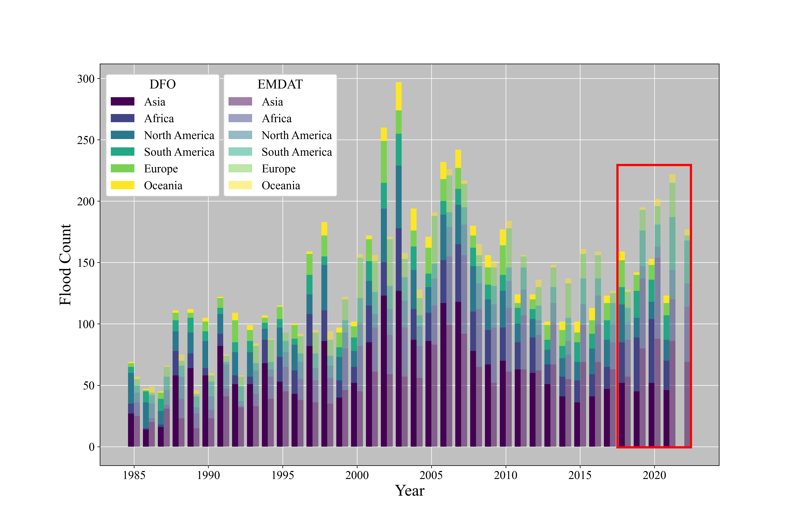

# FloodViz: Scripts for visualizing flood events

---

## Set up

Generate the python environment using the `flood_viz.yml` file.

Activate the environment:

`conda activate flood_viz`

---
---

## Figure generation

### Histogram

To get a histogram of flood events from the DFO and EMDAT datasets (1985-2022), run:

`python floodviz.py -s flood_freq`

<figure>
    
    <figcaption> <b>Figure 1.</b> Global flood counts grouped by continent from two datasets from 1985-2022.
</figure>

---
---

### Classification Plots

To get a plot of a specific flood event, run:

`python floodviz.py -s raster_class -in "Q:/.shortcut-targets-by-id/1SgdF6083uESHVdkIjBx5o-wSIUWvXPcf/Pak_max_flood/42/S/XA/2022/8/31/" -szn True -g "Q:/My Drive" -fc True -tc True -n 1 -hex False`

where the -in flag points to the directory containing the flood event you wish to plot.

---

To produce a series of flood plots, run:

`python floodviz.py -s raster_class -in "Q:/.shortcut-targets-by-id/1SgdF6083uESHVdkIjBx5o-wSIUWvXPcf/Pak_max_flood/" -szn True -g "Q:/My Drive" -fc True -tc True -n 6 -hex False`

where the -in flag points to the parent directory containing all of the flood events you wish to plot.

---

**Optional parameters:**

```
usage: floodviz.py [-h] [-s SCRIPT] [-in INPUT_DIR] [-szn SEASONAL] [-g GDRIVE] [-fc FALSE_COLOR] [-tc TRUE_COLOR]
                   [-n NUMBER] [-hex HEXBIN]

Plots and saves images of classified flood events.

options:
  -h, --help            show this help message and exit
  -s SCRIPT, --script SCRIPT
                        Input the name of the flood visualizations you want. (raster_class OR flood_freq)
  -in INPUT_DIR, --input_dir INPUT_DIR
                        Input base path that has flood classified rasters of interest.
  -szn SEASONAL, --seasonal SEASONAL
                        Set to True for seasonal classification images. Set to False for annual classification images.
                        DEFAULT = TRUE
  -g GDRIVE, --gdrive GDRIVE
                        Root Drive to your Desktop Google Drive.
                        DEFAULT = 'Q:/My Drive'
  -fc FALSE_COLOR, --false_color FALSE_COLOR
                        Display False Color image (True/False).
                        DEFAULT = TRUE
  -tc TRUE_COLOR, --true_color TRUE_COLOR
                        Display True Color image (True/False).
                        DEFAULT = TRUE
  -n NUMBER, --number NUMBER
                        Number of images to loop through from input dir.
                        DEFAULT = 3
  -hex HEXBIN, --hexbin HEXBIN
                        Add hexbin plot to classification figure (True/False).
                        DEFAULT = FALSE
```

---

**Example runs:**

`python floodviz.py -s raster_class -in "Q:/.shortcut-targets-by-id/1SgdF6083uESHVdkIjBx5o-wSIUWvXPcf/Pak_max_flood/" -szn True -g "Q:/My Drive" -fc True -tc True -n 6 -hex False`

<figure>
    
    <figcaption> <b>Figure 2.</b> Classified flood map with permanent, seasonal, and flood water labeled (without the hexbin plot) and the True and False Color images.
</figure>

`python floodviz.py -s raster_class -in "Q:/.shortcut-targets-by-id/1SgdF6083uESHVdkIjBx5o-wSIUWvXPcf/Pak_max_flood/" -szn True -g "Q:/My Drive" -fc True -tc True -n 6 -hex True`

<figure>
    
    <figcaption> <b>Figure 3.</b> Classified flood map with permanent, seasonal, and flood water labeled (with the hexbin plot) and the True and False Color images.
</figure>

`python floodviz.py -s raster_class -in "Q:/.shortcut-targets-by-id/1SgdF6083uESHVdkIjBx5o-wSIUWvXPcf/Pak_max_flood/" -szn True -g "Q:/My Drive" -fc True -tc False -n 6 -hex True`

<figure>
    
    <figcaption> <b>Figure 4.</b> Classified flood map with permanent and flood water labeled (with the hexbin plot) and the False Color images.
</figure>